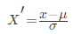

### 一、机器学习

1. 机器学习简介

机器学习是人工智能的一个分支。机器学习是实现人工智能的一个途径，即以机器学习为手段解决人工智能中的问题。**机器学习算法是一类从数据中自动分析获得规律（模型），并利用规律对未知数据进行预测的算法** 

2. 机器学习概述

收集数据--> 准备输入数据--> 分析输入数据-->训练算法-->测试算法-->使用算法

这里主要使用到了`Numpy、Scikit-learn`

- 跑数据，各种map-reduce，hive SQL，数据仓库搬砖
- 数据清洗，数据清洗，数据清洗
- 分析业务，分析case，找特征
- 常用算法跑模型

而普通程序员的工作是

1. 学会分析问题
2. 掌握算法基本思想，学会对问题用相应的算法解决
3. 学会利用简便的库或者框架解决问题

### 二、特征工程和文本特征提取

1. 数据集的组成

“数据决定了机器学习的上限，而算法只是尽可能逼近这个上限”.

2. 特征工程的定义

从数据中抽取出来的对预测结果有用的信息，通过专业的技巧进行数据处理，是的特征能在机器学习算法中发挥更好的作用

特征工程中最重要的一个环节就是特征处理，特征处理包含了很多具体的专业技巧

- 单个特征
  - 归一化
  - 标准化
  - 缺失值
- 多个特征
  - 降维
    - PCA

3. 字典的特征数据抽取

数据特征提取

**方法**DictVectorizer

```python
from sklearn.feature_extraction import DictVectorizer
onehot = DictVectorizer() # 如果结果不用toarray，请开启sparse=False
instances = [{'city': '北京','temperature':100},{'city': '上海','temperature':60}, {'city': '深圳','temperature':30}]
X = onehot.fit_transform(instances).toarray()
print(onehot.inverse_transform(X))
```

4. 文本特征抽取以及中文问题

文本特征提取

**方法**CountVectorizer

```
from sklearn.feature_extraction.text import CountVectorizer
content = ["life is short,i like python","life is too long,i dislike python"]
vectorizer = CountVectorizer()
print(vectorizer.fit_transform(content).toarray())
```

但是这里需要注意的是对于中文需要使用jiaba进行中文词语的切词处理

具体代码在py文件当中


5. tf-idf分析问题

   方法**TfidfVectorizer学习词汇和idf，返回术语文档矩阵。

```
from sklearn.feature_extraction.text import TfidfVectorizer
content = ["life is short,i like python","life is too long,i dislike python"]
vectorizer = TfidfVectorizer(stop_words='english')
print(vectorizer.fit_transform(content).toarray())
print(vectorizer.vocabulary_)
```


### 三、数据特征预处理

1. 特征预处理-归一化

> 归一化首先在特征（维度）非常多的时候，可以防止某一维或某几维对数据影响过大，也是为了把不同来源的数据统一到一个参考区间下，这样比较起来才有意义，其次可以程序可以运行更快。

**min-max方法**

通过对原始数据进行线性变换把数据映射到[0,1]之间，变换的函数为：


其中min是样本中最小值，max是样本中最大值

```python
mm = MinMaxScaler(feature_range=(2, 3))	# 将数据缩放到2,3之间
data = mm.fit_transform([[90, 2, 10, 40], [60, 4, 15, 45], [75, 3, 13, 46]])
print(data)
```


2. 归一化以及标准化对比

常用的方法是z-score标准化，经过处理后的数据均值为0，标准差为1，处理方法是：



其中μ是样本的均值，σ是样本的标准差

```python
std = StandardScaler()
source = [[1., -1., 3.],
          [2., 4., 2.],
          [4., 6., -1.]]
data = std.fit_transform(source)
print(data)
```

3. 缺失值的处理

数据缺失可能会丢失有价值的数据，最好的策略就是估算缺失值，即从已知部分的数据中推断它们。

填充缺失值 使用`sklearn.preprocessing`中的`Imputer`类进行数据的填充

```python
im = Imputer(missing_values='NaN', strategy='mean', axis=0)
data = im.fit_transform([[1, 2], [np.nan, 3], [7, 6]])
print(data)
```

插补策略

- 如果是“平均值”，则使用沿轴的平均值替换缺失值
- 如果为“中位数”，则使用沿轴的中位数替换缺失值
- 如果“most_frequent”，则使用沿轴最频繁的值替换缺失

插补的轴

- 如果axis = 0，则沿列排列
- 如果axis = 1，则沿行排列

### 四、数据降维

1. 数据将为的特征选择

PCA(Principal component analysis),主成分分析。特点是保存数据集中对方差影响最大的那些特征，PCA极其容易受到数据中特征范围影响

```python
pca = PCA(n_components=0.9)
data_source = [
    [2, 8, 4, 5],
    [6, 3, 0, 8],
    [5, 4, 9, 1]
]
data = pca.fit_transform(data_source)
print(data)
```

2. 降维案例分析(探究：用户对物品类别的喜好细分降维)

数据：      

| products.csv              | 商品信息       |
| ------------------------- | ---------- |
| order_products__prior.csv | 订单与商品信息    |
| orders.csv                | 用户的订单信息    |
| aisles.csv                | 商品所属具体物品类别 |