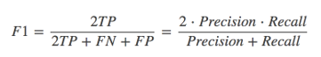

### 一、朴素贝叶斯概率

联合概率：包含多个条件，且所有条件同时成立的概率

记作：P(A,B)

条件概率：就是事件A在另外一个事件B已经发生条件下的发生概率

记作：P(A|B)

特性：P(A1,A2|B) = P(A1|B)P(A2|B)

注意：此条件概率的成立，是由于A1,A2相互独立的结果

朴素贝叶斯-贝叶斯公式

注：w为给定文档的特征值(频数统计,预测文档提供)，c为文档类别

公式可以理解为：

其中c可以是不同类别

公式分为三个部分：

- P(C)：每个文档类别的概率(某文档类别词数／总文档词数)
- P(W│C)：给定类别下特征（被预测文档中出现的词）的概率

计算方法：P(F1│C)=Ni/N  （训练文档中去计算）

Ni为该F1词在C类别所有文档中出现的次数

N为所属类别C下的文档所有词出现的次数和

P(F1,F2,…)     预测文档中每个词的概率 

**拉普拉斯平滑**

α为指定的系数一般为1，m为训练文档中统计出的特征词个数

### 二、朴素贝叶斯

> sklearn.naive_bayes.MultinomialNB(不需要调参哦)

朴素贝叶斯：文本分类

神经网络效果好

朴素贝叶斯分类的优缺点：

优点：

- 发源于古典数学理论，有稳定的分类效率
- 对缺失数据不太敏感，算法简单，多用于文本分类
- 分类精确度高，速度快

缺点：

- 使用样本属性独立性的假设，所以如果样本属性有关联时效果不好

### 三、混淆矩阵

在分类任务下，预测结果(Predicted Condition)与正确标记(True Condition)之间存在四种不同的组合，构成混淆矩阵(适用于多分类)

> 评估标准：准确率精确率和召回率

精确率：预测结果为正例样本中真实为正例的比例（查得准）

召回率：真实为正例的样本中预测结果为正例的比例（查的全，对正样本的区分能力）

其他分类标准，F1-score，反映了模型的稳健型

`classification_report`

sklearn.metrics.classification_report(y_true, y_pred, target_names=None)

y_true：真实目标值

y_pred：估计器预测目标值

target_names：目标类别名称

return：每个类别精确率与召回率

