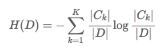
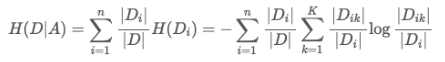

> 在决策树的结构中，每一个实例都被一条路径或者一条规则所覆盖。通常决策树学习包括三个步骤：**特征选择**、决策树的生成和决策树的修剪
>
> 优点：计算复杂度不高，输出结果易于理解，对中间值的缺失不敏感，**可以处理逻辑回归等不能解决的非线性特征数据**
>
> 缺点：可能产生过度匹配问题
>
> 适用数据类型：数值型和标称型

### 一、决策树的信息论

**信息的度量和作用**:1948年，香农在他的论文“通信的数学原理”中提到了“信息熵”的概念，才解决了信息的度量问题，并量化出信息的作用。

香农指出，它的准确信息量应该是：

H = -(p1*logp1 + p2*logp2 + ... + p32log32)

其中，p1...p32为这三支球队夺冠的概率。**H的专业术语称之为信息熵，单位为比特**，当这32支球队夺冠的几率相同时，对应的信息熵等于5比特，这个可以通过计算得出。有一个特性就是，5比特是公式的最大值。那么信息熵（经验熵）的具体定义可以为如下：

​                                                                      H(X)=∑x∈XP(x)logP(x)


**信息增益:**（information gain）决策树的过程其实是在寻找某一个特征对整个分类结果的不确定减少的过程。那么这样就有一个概念

**那么信息增益表示得知特征X的信息而是的类Y的信息的不确定性减少的程度**，所以我们对于选择特征进行分类的时候，当然选择信息增益较大的特征，这样具有较强的分类能力。特征A对训练数据集D的信息增益g(D,A),定义为集合D的经验熵H(D)与特征A给定条件下D的经验条件熵H(D|A)之差，即公式为：

​                                                                     g(D,A)=H(D)−H(D∣A)

**根据信息增益的准则的特征选择方法是：对于训练数据集D，计算其每个特征的信息增益，并比较它们的阿笑，选择信息增益最大的特征**


**信息增益的计算:**假设训练数据集为D，|D|表示样本个数。设有K个类C_kCk,k=1,2,3,4...k,|C_k|∣Ck∣为属于类C_kCk的样本个数，\sum_{k=1}^{K}{=}{|D|}∑k=1K=∣D∣.设特征A有n个不同的取值{a1,a2,...,an},根据特征A的取值将D划分为n个子集D1，D2，...，Dn，|Di|∣Di∣为样本个数，其中Di中属于Ck类的样本的集合为D_ikDik

所以首先对于经验熵来说，计算如下：



那么条件熵计算如下：



### 二、决策树的划分

sklearn.tree.DecisionTreeClassifier是一个能对数据集进行多分类的类

```python
class sklearn.tree.DecisionTreeClassifier(criterion='gini', splitter='best', max_depth=None, min_samples_split=2, min_samples_leaf=1, min_weight_fraction_leaf=0.0, max_features=None, random_state=None, max_leaf_nodes=None, min_impurity_split=1e-07, class_weight=None, presort=False)
  """
  :param max_depth：int或None，可选（默认=无）树的最大深度。如果没有，那么节点将被扩展，直到所有的叶子都是纯类，或者直到所有的叶子都包含少于min_samples_split样本

  :param random_state：random_state是随机数生成器使用的种子
  """
```

导入类，以及数据集，还有将数据分成训练数据集和测试数据集两部分

```python
from sklearn.model_selection import train_test_split
from sklearn.datasets import load_iris
from sklearn.tree import DecisionTreeClassifier
iris = load_iris()
X = iris.data
y = iris.target
X_train, X_test, y_train, y_test = train_test_split(X, y, random_state=0)
estimator = DecisionTreeClassifier(max_leaf_nodes=3, random_state=0)
estimator.fit(X_train, y_train)
```

常用方法:

| method        | use                                  | detail          |
| ------------- | ------------------------------------ | --------------- |
| apply         | estimator.apply(X)                   | 返回每个样本被预测的叶子的索引 |
| decision_path | dp = estimator.decision_path(X_test) | 返回树中的决策路径       |
| fit_transform | fit_transform(X,y=None,fit_params)   | 输入数据，然后转换       |
| predict       | predict(X)                           | 预测输入数据的类型,完整代码  |
| score         | score(X,y,sample_weight=None)        | 返回给定测试数据的准确精度   |


### 三、决策树的保存结果

**sklearn.tree.export_graphviz()** 该函数能够导出DOT格式

```python
from sklearn.datasets import load_iris
from sklearn import tree
clf = tree.DecisionTreeClassifier()
iris = load_iris()
clf = clf.fit(iris.data, iris.target)
tree.export_graphviz(clf,out_file='turing_tree.dot')
```

通过命令转换为png或者pdf格式，首先得安装graphviz

```haskell
ubuntu:sudo apt-get install graphviz
Mac:brew install graphviz
```

然后我们运行这个命令

```haskell
$ dot -Tps tree.dot -o tree.ps
$ dot -Tpng tree.dot -o tree.png
```

或者，如果我们安装了Python模块pydotplus，我们可以直接在Python中生成PDF文件，通过 `pip install pydotplus`，然后运行

```python
import pydotplus
dot_data = tree.export_graphviz(clf, out_file=None)
graph = pydotplus.graph_from_dot_data(dot_data)
graph.write_pdf("iris.pdf")
```

辨析决策树算法

| arithmetic | detail                                   |
| ---------- | ---------------------------------------- |
| ID3        | 信息增益 最大的准则                               |
| C4.5       | 信息增益比 最大的准则                              |
| CART  回归树  | 平方误差 最小 分类树: 基尼系数 最小的准则 在sklearn中可以选择划分的原则 |

决策树优缺点分析

| advantage                                | disadvantage                             |
| ---------------------------------------- | ---------------------------------------- |
| 简单的理解和解释。树木可视化。                          | 决策树学习者可以创建不能很好地推广数据的过于复杂的树。这被称为过拟合。修剪（目前不支持）的机制，设置叶节点所需的最小采样数或设置树的最大深度是避免此问题的必要条件。 |
| 需要很少的数据准备。其他技术通常需要数据归一化，需要创建虚拟变量，并删除空值。但请注意，此模块不支持缺少值。 | 决策树可能不稳定，因为数据的小变化可能会导致完全不同的树被生成。通过使用合奏中的决策树来减轻这个问题。 |
| 使用树的成本（即，预测数据）在用于训练树的数据点的数量上是对数的。        |                                          |


### 四、随机森林的原理和调优

> 随机森林是一个包含多个决策树的分类器，并且其输出的类别是由个别树输出的类别的众数而定。利用相同的训练数搭建多个独立的分类模型，然后通过投票的方式，以少数服从多数的原则作出最终的分类决策。

**创建一颗树**

- 用N来表示训练用例(样本)的个数，M表示特征数目
- 输入特征数目m,用于确定决策树上一个节点的决策结果，其中m应小于M
- 从N个训练用例(样本)中以放回抽样的方式，取样N次，形成一个训练集(即bootstrap取样),并用我撑到的用例(样本)作预测，评估其误差
- 对于诶一个节点，随机选择m个特征，决策树上每个节点的决定都是基于这些特征确定的。根据m个特征，计算其最佳的分类方式

 **sklearn.ensemble，集成方法模块**

sklearn.ensemble提供了准确性更加好的集成方法，里面包含了主要的RandomForestClassifier(随机森林)方法。

```python
class sklearn.ensemble.RandomForestClassifier(n_estimators=10, criterion='gini', max_depth=None, bootstrap=True, oob_score=False, n_jobs=1, random_state=None)
  """
  :param n_estimators：integer，optional（default = 10） 森林里的树木数量。

  :param criteria：string，可选（default =“gini”）分割特征的测量方法

  :param max_depth：integer或None，可选（默认=无）树的最大深度

  :param bootstrap：boolean，optional（default = True）是否在构建树时使用自举样本。

  """
```

**属性**

| property             | detail                                   |
| -------------------- | ---------------------------------------- |
| classes_             | shape = [n_classes]的数组或这样的数组的列表，类标签（单输出问题）或类标签数组列表（多输出问题） |
| feature*importances* | array = [n_features]的数组， 特征重要性（越高，功能越重要） |

**方法**

| method        | user                          | detail           |
| ------------- | ----------------------------- | ---------------- |
| fit           | fit(X, y [, sample_weight])   | 从训练集(X, Y)构建一棵树林 |
| predict       | prediict(X)                   | 预测X的类            |
| score         | score(X, y [, sample_weight]) | 返回给定测试数据和标签的平均精度 |
| decision_path | decision_path(X)              | 返回森林中的决策路径       |

**案例**

```python
import pandas as pd
import sklearn
from sklearn.cross_validation import train_test_split
from sklearn.feature_extraction import DictVectorizer
from sklearn.tree import DecisionTreeClassifier
from sklearn.metrics import classification_report
from sklearn.ensemble import RandomForestClassifier, GradientBoostingClassifier


titanic = pd.read_csv('http://biostat.mc.vanderbilt.edu/wiki/pub/Main/DataSets/titanic.txt')

#选取一些特征作为我们划分的依据
x = titanic[['pclass', 'age', 'sex']]
y = titanic['survived']

# 填充缺失值
x['age'].fillna(x['age'].mean(), inplace=True)

x_train, x_test, y_train, y_test = train_test_split(x, y, test_size=0.25)

dt = DictVectorizer(sparse=False)

print(x_train.to_dict(orient="record"))

# 按行，样本名字为键，列名也为键，[{"1":1,"2":2,"3":3}]
x_train = dt.fit_transform(x_train.to_dict(orient="record"))

x_test = dt.fit_transform(x_test.to_dict(orient="record"))

# 使用决策树
dtc = DecisionTreeClassifier()

dtc.fit(x_train, y_train)

dt_predict = dtc.predict(x_test)

print(dtc.score(x_test, y_test))

print(classification_report(y_test, dt_predict, target_names=["died", "survived"]))

# 使用随机森林

rfc = RandomForestClassifier()

rfc.fit(x_train, y_train)

rfc_y_predict = rfc.predict(x_test)

print(rfc.score(x_test, y_test))

print(classification_report(y_test, rfc_y_predict, target_names=["died", "survived"]))
```

