### 一、线性回归的定义及矩阵运算

线性回归的定义是：目标值预期是输入变量的线性组合。线性模型形式简单、易于建模，但却蕴含着机器学习中一些重要的基本思想。线性回归，是利用数理统计中回归分析，来确定两种或两种以上变量间相互依赖的定量关系的一种统计分析方法，运用十分广泛。

> 优点：结果易于理解，计算不复杂
>
> 缺点：对非线性的数据拟合不好
>
> 适用数据类型：数值型和标称型

房价例子中房子的大小预测房子的价格。**f(x) = w1\*x+w0**，这样通过主要参数w1就可以得出预测的值。

通用公式为：

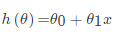

对于多变量回归，例如：瓜的好坏程度 **f(x) = w0+0.2色泽+0.5根蒂+0.3\*敲声**，得出的值来判断一个瓜的好与不好的程度。

通用公式为：

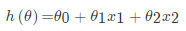

线性模型中的向量W值，客观的表达了各属性在预测中的重要性，因此线性模型有很好的解释性。对于这种“多特征预测”也就是（多元线性回归），那么线性回归就是在这个基础上得到这些W的值，然后以这些值来建立模型，预测测试数据。

因此可以通过向量的方式来表示W值与特征X值之间的关系：

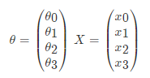

两向量相乘，结果为一个整数是估计值,其中所有特征集合的第一个特征值x_0x0=1,那么我们可以通过通用的向量公式来表示线性模型：

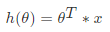

**损失函数**

损失函数是一个贯穿整个机器学习重要的一个概念，大部分机器学习算法都会有误差，通过显性的公式来描述这个误差，并且将这个误差优化到最小值。

对于线性回归模型，将模型与数据点之间的距离差之和做为衡量匹配好坏的标准，误差越小,匹配程度越大。要找的模型就是需要将f(x)和我们的真实值之间最相似的状态。于是就有了误差公式，模型与数据差的平方和最小：

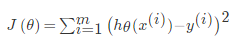

为了使这个值最小，就有了`梯度下降算法`和`正规方程解法`


### 二、线性回归策略和优化
**梯度下降**

上面误差公式是一个通式，我们取两个单个变量来求最小值，误差和可以表示为：

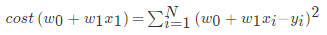

可以通过调整不同的`w1`和`w0`的值，就能使误差不断变化，而当你找到这个公式的最小值时，你就能得到最好的`w1`,`w0` 而这对`(w1,w0)`就是能最好描述你数据关系的模型参数。

找cost(w0+w1x1)的放法就是求解关于cost与w1的偏导数，当其为最小时即可

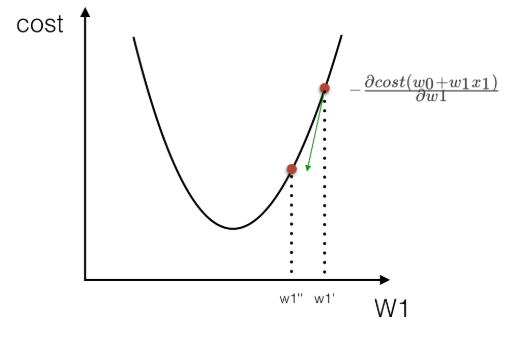

所以有:

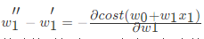

个过程是按照某一点在`w1`上的偏导数下降寻找最低点。当然在进行移动的时候也需要考虑，每次移动的速度，也就是`α`的值,这个值也叫做（学习率），如下式：

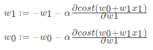

**LinearRegression**

```python
class LinearRegression(fit_intercept = True，normalize = False，copy_X = True，n_jobs = 1)
  """
  :param normalize:如果设置为True时，数据进行标准化。请在使用normalize = False的估计器调时用fit之前使用preprocessing.StandardScaler

  :param copy_X:boolean，可选，默认为True，如果为True，则X将被复制

  :param n_jobs：int，可选，默认1。用于计算的CPU核数
  """
    
reg = LinearRegression()
```

**方法**

| method  | use                               | detail                            |
| ------- | --------------------------------- | --------------------------------- |
| fit     | reg.fit(X,y,sample_weight = None) | 使用X作为训练数据拟合模型，y作为X的类别值。X，y为数组或者矩阵 |
| predict | reg.predict([[3,3]])              | 预测提供的数据对应的结果                      |

**属性**

| 属性         | use       | detail              |
| ---------- | --------- | ------------------- |
| coef__     | reg.coef_ | 表示回归系数w=(w1,w2....) |
| intercept_ |           | 表示w0                |

**加入交叉验证**

> 由于sklearn中另外两种回归岭回归、lasso回归都提供了回归CV方法，比如linear_model.Lasso，交叉验证linear_model.LassoCV; linear_model.Ridge, 交叉验证linear_model.RidgeCV。所以需要通过cross_validation提供的方法进行k-折交叉验证。

```python
from sklearn.datasets.samples_generator import make_regression
from sklearn.model_selection import cross_val_score
from sklearn import linear_model
import matplotlib.pyplot as plt

lr = linear_model.LinearRegression()
X, y = make_regression(n_samples=200, n_features=5000, random_state=0)
result = cross_val_score(lr, X, y)
print result
```

### 三、线性回归的求解总结

使用scikit-learn中内置的回归模型对“美国波士顿房价”数据进行预测,网址：[https://www.kaggle.com/datasets](https://www.kaggle.com/datasets)

**1.美国波士顿地区房价数据描述**

```python
from sklearn.datasets import load_boston

boston = load_boston()

print boston.DESCR
```

**2.波士顿地区房价数据分割**

```python
from sklearn.cross_validation import train_test_split
import numpy as np
X = boston.data
y = boston.target

X_train,X_test,y_train,y_test = train_test_split(X,y,random_state=33,test_size = 0.25)
```

**3.训练与测试数据标准化处理**

```python
from sklearn.preprocessing import StandardScaler
ss_X = StandardScaler()
ss_y = StandardScaler()

X_train = ss_X.fit_transform(X_train)
X_test = ss_X.transform(X_test)
y_train = ss_X.fit_transform(y_train)
X_train = ss_X.transform(y_test)
```

**4.使用最简单的线性回归模型LinearRegression和梯度下降估计SGDRegressor对房价进行预测**

```python
from sklearn.linear_model import LinearRegression
lr = LinearRegression()
lr.fit(X_train,y_train)
lr_y_predict = lr.predict(X_test)

from sklearn.linear_model import SGDRegressor
sgdr = SGDRegressor()
sgdr.fit(X_train,y_train)
sgdr_y_predict = sgdr.predict(X_test)
```

**5.性能评测**

对于不同的类别预测，我们不能苛刻的要求回归预测的数值结果要严格的与真实值相同。一般情况下，我们希望衡量预测值与真实值之间的差距。因此，可以测评函数进行评价。其中最为直观的评价指标均方误差(Mean Squared Error)MSE，因为这也是线性回归模型所要优化的目标。

MSE的计算方法如式：

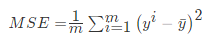

**使用MSE评价机制对两种模型的回归性能作出评价**

```python
from sklearn.metrics import mean_squared_error

print '线性回归模型的均方误差为：',mean_squared_error(ss_y.inverse_transform(y_test),ss_y.inverse_tranform(lr_y_predict))
print '梯度下降模型的均方误差为：',mean_squared_error(ss_y.inverse_transform(y_test),ss_y.inverse_tranform(sgdr_y_predict))
```

通过这一比较发现，使用梯度下降估计参数的方法在性能表现上不及使用解析方法的LinearRegression，但是如果面对训练数据规模十分庞大的任务，随即梯度法不论是在分类还是回归问题上都表现的十分高效，可以在不损失过多性能的前提下，节省大量计算时间。根据Scikit-learn光网的建议，如果数据规模超过10万，推荐使用随机梯度法估计参数模型。

> 注意：线性回归器是最为简单、易用的回归模型。正式因为其对特征与回归目标之间的线性假设，从某种程度上说也局限了其应用范围。特别是，现实生活中的许多实例数据的各种特征与回归目标之间，绝大多数不能保证严格的线性关系。尽管如此，在不清楚特征之间关系的前提下，我们仍然可以使用线性回归模型作为大多数数据分析的基线系统。

### 四、过拟合以及欠拟合

在对训练数据进行拟合时，需要照顾到每个点，而其中有一些噪点，当某个模型过度的学习训练数据中的细节和噪音，以至于模型在新的数据上表现很差，这样的话模型容易复杂，拟合程度较高，造成过拟合。而相反如果值描绘了一部分数据那么模型复杂度过于简单，欠拟合指的是模型在训练和预测时表现都不好的情况，称为欠拟合。

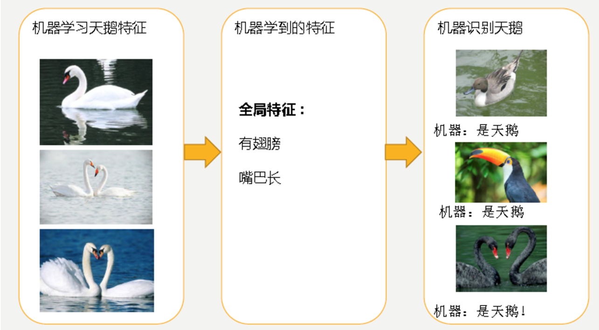

欠拟合**underfitting**指的是模型在训练和预测时表现都不好的情况，欠拟合通常不被讨论，因为给定一个评估模型表现的指标的情况下，欠拟合很容易被发现。矫正方法是继续学习并且试着更换机器学习算法。

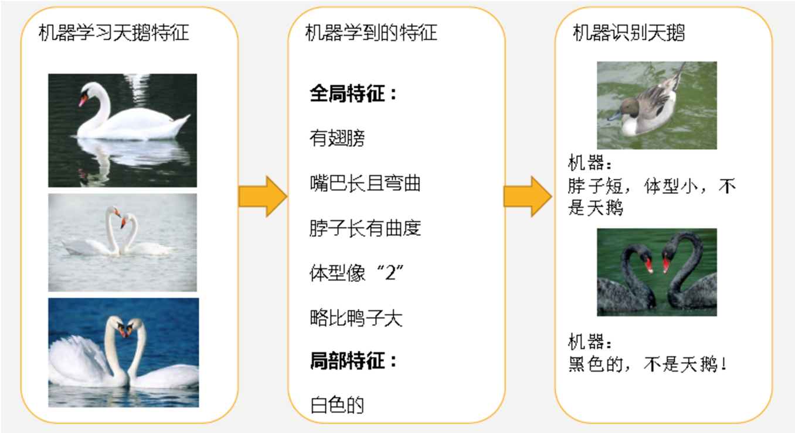

对于过拟合**overfitting**，特征集合数目过多，我们需要做的是尽量不让回归系数数量变多，对拟合（损失函数）加以限制。

（1）当然解决过拟合的问题可以减少特征数，显然这只是权宜之计，因为特征意味着信息，放弃特征也就等同于丢弃信息，要知道，特征的获取往往也是艰苦卓绝的。

（2）引入了 **正则化** 概念。

### 五、Ridge岭回归分析

岭回归是一种专用于共线性数据分析的有偏估计回归方法，实质上是一种改良的最小二乘估计法，通过放弃最小二乘法的无偏性，以损失部分信息、降低精度为代价获得回归系数更为符合实际、更可靠的回归方法，对病态数据的拟合要强于最小二乘法。当数据集中存在共线性的时候，岭回归就会有用。

**sklearn.linear_model.Ridge**

```python
class sklearn.linear_model.Ridge(alpha=1.0, fit_intercept=True, normalize=False, copy_X=True, max_iter=None, tol=0.001, solver='auto', random_state=None)**
  """
  :param alpha:float类型，正规化的程度
  """
from sklearn.linear_model import Ridge
clf = Ridge(alpha=1.0)
clf.fit([[0, 0], [0, 0], [1, 1]], [0, .1, 1]))
```

方法

| method | use                             | detail      |
| ------ | ------------------------------- | ----------- |
| score  | score(X, y, sample_weight=None) | clf.score() |

属性

| attribute  | detail         |
| ---------- | -------------- |
| coef_      | clf.coef_      |
| intercept_ | clf.intercept_ |