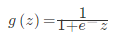
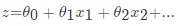
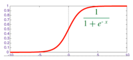
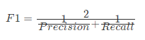

### 一、模型的加载

```
# 用于模型的加载和保存
from sklearn.externals import joblib

lr.fit(x_train, y_train)
# 保存训练好的模型
joblib.dump(lr, './doc/doc.pkl')
joblib.load('./doc/doc.pkl')

```

### 二、逻辑回归定义, 损失函数, 优化与线性回归的比较

> 逻辑回归（Logistic Regression），简称LR。特征输入集合转化为0和1这两类的概率。
>
> 优点：计算代价不高，易于理解和实现
>
> 缺点：容易欠拟合，分类精度不高
>
> 适用数据：数值型和标称型

Logistic回归用来分类0/1问题，也就是预测结果属于0或者1的二值分类问题

映射函数为：



其中



映射出来的效果如下如：



**sklearn.linear_model.LogisticRegression**

逻辑回归类

```python
class sklearn.linear_model.LogisticRegression(penalty='l2', dual=False, tol=0.0001, C=1.0, fit_intercept=True, intercept_scaling=1, class_weight=None, random_state=None, solver='liblinear', max_iter=100, multi_class='ovr', verbose=0, warm_start=False, n_jobs=1)
  """
  :param C: float，默认值：1.0

  :param penalty: 特征选择的方式

  :param tol: 公差停止标准
  """
```

**方法**

| method                     | detail           |
| -------------------------- | ---------------- |
| decision_function(X)       | 预测样品的置信度分数       |
| densify()                  | 将系数矩阵转化为密集数组格式   |
| fit(X,y[sample>weight])    | 根据给定的训练数据拟合模型    |
| fit_transform(X,[y])       | 适合数据，然后转换        |
| get_params([深])            | 获取此估计器的参数        |
| predict(X)                 | 预测X中样本的类标签       |
| predict_log_proba(X)       | 概率估计的记录          |
| score(X,y[sample_weight])  | 返回给定测试数据和标签的平均精度 |
| set_params(\*\*PARAMS)     | 设置该估计器           |
| sparsify()                 | 将系数矩阵转化为稀疏格式     |
| transform(\*agrs,**kwargs) |                  |

属性

|       | detail               |
| ----- | -------------------- |
| coef_ | 决策功能的特征系数            |
| Cs_   | 数组C,即用于交叉验证的正则化数组的倒数 |


### 三、逻辑回归预测癌症

原始数据的下载地址为：[https://archive.ics.uci.edu/ml/machine-learning-databases/breast-cancer-wisconsin/](https://archive.ics.uci.edu/ml/machine-learning-databases/breast-cancer-wisconsin/)

**数据预处理**

```python
# 根据官方数据构建类别
column_names = ['Sample code number','Clump Thickness','Uniformity of Cell Size','Uniformity of Cell Shape','Marginal Adhesion','Single Epithelial Cell Size','Bare Nuclei','Bland Chromatin','Normal Nucleoli','Mitoses','Class'],

data = pd.read_csv('https://archive.ics.uci.edu/ml/machine-learning-databases/breast-cancer-wisconsin/',names = column_names)

# 将？替换成标准缺失值表示
data = data.replace(to_replace='?',value = np.nan)

# 丢弃带有缺失值的数据（只要一个维度有缺失）
data = data.dropna(how='any')

data.shape
```

处理的缺失值后的样本共有683条，特征包括细胞厚度、细胞大小、形状等九个维度

**准备训练测试数据**

```python
X_train,X_test,y_train,y_test = train_test_split(data[column_names[1:10]],data[column_names[10]],test_size=0.25,random_state=42)
# 交叉验证里面的哦！！！！
# 查看训练和测试样本的数量和类别分布
y_train.value_counts()

y_test.value_counts()
```

**使用逻辑回归进行良／恶性肿瘤预测任务**

```python
# 标准化数据，保证每个维度的特征数据方差为1，均值为0。使得预测结果不会被某些维度过大的特征值而主导
ss = StandardScaler()

X_train = ss.fit_transform(X_train)
X_test = ss.transform(X_test)

# 初始化 LogisticRegression

lr = LogisticRegression(C=1.0, penalty='l1', tol=0.01)

# 跳用LogisticRegression中的fit函数／模块来训练模型参数
lr.fit(X_train,y_train)

lr_y_predict = lr.predict(X_test)
```

**性能分析**

```python
from sklearn.metrics import classification_report

# 利用逻辑斯蒂回归自带的评分函数score获得模型在测试集上的准确定结果
print '精确率为：',lr.score(X_test,y_test)

print classification_report(y_test,lr_y_predict,target_names = ['Benign','Maligant'])
```

### 四、总结

实际问题中，衡量分类器任务的成功程度是通过固定的性能指标来获取。最常见使用的是准确率。但有时候，我们关注的是负样本是否被正确诊断出来。

例如，关于肿瘤的的判定，需要更加关心多少恶性肿瘤被正确的诊断出来。也就是说，在二类分类任务下，预测结果(Predicted Condition)与正确标记(True Condition)之间存在四种不同的组合，构成混淆矩阵。


在分类中，当某个类别的重要性高于其他类别时，我们就可以利用上述定义出多个逼错误率更好的新指标。第一个指标就是正确率（Precision），它等于TP/(TP+FP)，给出的是预测为正例的样本中占真实结果总数的比例。第二个指标是召回率（Recall）。它等于TP/(TP+FN)，给出的是预测为正例的真实正例占所有真实正例的比例。

那么除了正确率和精确率这两个指标之外，为了综合考量召回率和精确率，我们计算这两个指标的调和平均数，得到F1指标（F1 measure）:



之所以使用调和平均数，是因为它除了具备平均功能外，还会对那些召回率和精确率更加接近的模型给予更高的分数；而这也是我们所希望的，因为那些召回率和精确率差距过大的学习模型，往往没有足够的使用价值。

**sklearn.metrics.classification_report**

sklearn中metrics中提供了计算四个指标的模块，也就是classification_report。

```python
classification_report(y_true, y_pred, labels=None, target_names=None, digits=2)
  """
  计算分类指标
  :param y_true:真实目标值

  :param y_pred:分类器返回的估计值

  :param target_names:可选的，计算与目标类别匹配的结果

  :param digits:格式化输出浮点值的位数

  :return :字符串，三个指标值

  """
```
**example**

```python
from sklearn.metrics import classification_report
y_true = [0, 1, 2, 3, 2]
y_pred = [0, 0, 2, 2, 1]
target_names = ['class 0', 'class 1', 'class 2','class 3']
# 
print(classification_report(y_true, y_pred, target_names=target_names))
```