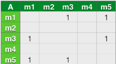
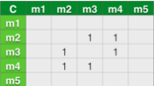
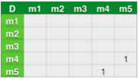
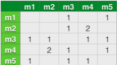
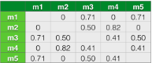
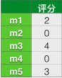

### 基于协同过滤的推荐系统

为了让推荐结果符合用户口味，我们需要深入了解用户和物品。用户的兴趣是不断变化的，但用户不会不停的更新兴趣描述。最后，很多时候用户并不知道自己喜欢什么，或者很难用语言描述自己喜欢什么，因此，我们需要通过算法自动发觉用户行为数据，从用户的行为中推测用户的兴趣，从而给用户推荐满足他们兴趣的物品。通常我们会给用户推荐其它用户看过的物品，或者是浏览物品相关的类似商品。

基于用户行为分析的推荐算法是个性化推荐系统的重要算法，学术界一般将这种类型的算法称为协同过滤算法。顾名思义，协同过滤就是指用户可以齐心协力，通过不算地和网站互动，使自己的推荐列表能够不断过滤掉自己不感兴趣的物品，从而来满足自己的需求

#### 用户行为数据简介

用户行为数据最简单的存在形式就是日志。网站在运行过程中都产生大量原始日志，并将其存储在文件系统中。很多互联网业务会把多种原始日志按照用户行为汇总成会话日志。推荐系统和电子商务网站就会将原始日志描述成用户行为的会话日志。会话日志同存储在分布式数据仓库中，如支持离线分析的Hadoop Hive。这些日志记录了用户的各种行为，如在电子商务网站中这些行为主要包括网页浏览、购买、点击、评分和评论等。

用户行为在个性化推荐系统中一般分为两种：显性反馈行为和隐性反馈行为。显性反馈行为包括用户明确表示对物品喜好的行为。这些主要的方式都是采用评分和喜欢／不喜欢去收集显性反馈的方式。现在很多网站使用了5分的评分系统来让用户直接表达对物品的喜好。这些不同的显性反馈方式个有利弊。

和显性反馈行为相对的是隐性反馈行为。隐性反馈行为指得失那些不能明确反应用户喜好的行为。具体的代表就是页面浏览行为。

当然，在很多时候我们一般数据集中必须含有产生行为的用户和行为的对象就是所有行为都必须包含的。一般来说，不同的数据集包含不同的行为。目前使用较多的数据集：

- 无上下文信息的显性反馈数据集 每一条记录包含用户ID、物品ID和用户对物品的评分

#### 用户行为分析

仅仅基于用户行为数据涉及的推荐算法一般称为协同过滤算法。学术界对协同过滤算法进行了深入研究，提出了很多方法，比如基于领域的方法、隐语义模型等。在这些方法中，在业界得到最广泛应用的算法是基于领域的方法，而基于领域的方法主要包含下面两种：

- 基于物品的协同过滤算法 这种算法给用户推荐和他之前秀安的物品相似的物品
- 基于用户的协同过滤算法 这种算法给用户推荐和他兴趣相似的其他用户喜欢的物品

#### 基于物品的协同过滤算法

基于物品的协同过滤算法是目前业界应用最多的算法。无论是亚马逊网，还是Netflix、YouTube，其推荐算法的基础都是该算法。基于物品的协同过滤算法主要分为两步：

（1）计算物品之间的相似度

（2）计算被推荐物品的兴趣度

（3）根据物品的相似度和用户的历史行为给用户生成推荐列表

##### **1.计算物品相似度**

我们将通过一个公式来定义物品的相似度，这个公式叫做余弦相似度。其实有点类似KNN算法重的距离公式，都是找到最近相似的事物。其中N(i)是喜欢物品i的用户数，N(j)是喜欢物品j的用户数。公式的意思是共同喜欢i和j的人数／sqrt(喜欢i的人数*喜欢j的人数)

公式

从这个式子中可以看出，在协同过滤中两个物品产生相似度是因为它们共同被很多用户喜欢。那么如果需要计算相似度，需要构建一个基于物品的矩阵。我们通过一个用户和电影的简单例子来看一看

假设我们现在有用户A,B,C,D，电影m1,m2,m3,m4,m5,那么有用户看过这些电影

- A:m1,m3,m5
- B:m2,m4
- C:m2,m3,m4
- D:m4,m5

那么可以得出这样四个临时矩阵，对于用户A



用户B：


用户C：



用户D：



那么将上面的矩阵合并得到一个公共矩阵：



矩阵的里面的数字表示公共人数，那么接下来需要计算相似度，利用上面的公式,其中看过各个电影的人数为m1:1,m2:2,m3:2,m4:3,m5:2人。得到相似度矩阵：



##### **2.计算被推荐物品的兴趣度**

首先我们要建立用户对物品的评分矩阵，我们以A用户为例子，假设评分为：m1:2,m3:4,m5:3



那么计算被推荐物品的兴趣度计算公式为：

p(ij) = W(ij) * r(i)

其中W(ij)为推荐的与i相近的j物品，r(i)为用户对物品i的评分

通过这个式子我们可以得出兴趣度，但是推荐电影当然要去除已经看过的，用户A对电影m1,m3,m5每个相似度中只有m2,m4没有看过，所以计算m2,m4的兴趣度：

```
m3-m2: 4 * 0.50 = 2.00
m3-m4: 4 * 0.41 = 1.64
m5-m4: 3 * 0.41 = 1.23

```

那么我们确定一个要推荐的影片个数K，假设为1。那么通过比较我们得出兴趣度最高的是m2，则将m2推荐给A用户。

#### 思考

> 基于用户的协同过滤算法怎么实现？ 注：在实际网站推荐中大多都是使用基于物品的协同过滤算法，为什么？